# 🔬 ALS V2 - Sistema de Gestión de OIT con IA

> **Sistema inteligente de gestión de Órdenes de Inspección y Toma de muestras (OIT) con análisis automático, verificación de normas, muestreo versátil y generación de informes mediante Inteligencia Artificial**

[](https://www.typescriptlang.org/)
[](https://reactjs.org/)
[](https://nodejs.org/)
[](https://www.prisma.io/)
[](https://tailwindcss.com/)

---

## 📋 Tabla de Contenidos

- [Descripción General](#-descripción-general)
- [Arquitectura del Sistema](#-arquitectura-del-sistema)
- [Tecnologías Utilizadas](#-tecnologías-utilizadas)
- [Estructura del Proyecto](#-estructura-del-proyecto)
- [Flujo de Trabajo Completo](#-flujo-de-trabajo-completo)
- [Sistema de Muestreo Versátil](#-sistema-de-muestreo-versátil)
- [Instalación y Configuración](#-instalación-y-configuración)
- [Características Principales](#-características-principales)
- [API Endpoints](#-api-endpoints)
- [Base de Datos](#-base-de-datos)

---

## 🎯 Descripción General

**ALS V2** es un sistema integral para la gestión automatizada de Órdenes de Inspección y Toma de muestras (OIT), diseñado para optimizar y automatizar el proceso completo desde la creación hasta la generación del informe final.

### Características Clave

- ✨ **Análisis Automático con IA**: Procesamiento inteligente de documentos OIT y cotizaciones
- 📋 **Verificación de Normas**: Validación automática contra estándares definidos
- 🎯 **Planeación Inteligente**: Selección automática de plantillas y propuestas de agendamiento
- 🧪 **Muestreo Versátil**: Sistema modular de pasos dinámicos (6 tipos diferentes)
- 📊 **Informes Automáticos**: Generación de informes profesionales mediante IA
- 🔔 **Notificaciones en Tiempo Real**: Sistema completo de notificaciones push
- 📱 **Offline-First**: Captura de datos sin conexión con sincronización automática

---

## 🏗️ Arquitectura del Sistema

```
┌─────────────────────────────────────────────────────────────┐
│                      FRONTEND (React)                        │
│  ┌──────────┬──────────┬──────────┬──────────────────────┐ │
│  │   Pages  │Components│  Types   │      Services        │ │
│  │          │          │          │                      │ │
│  │ • OIT    │ • Step   │ • Sampling│ • API Client        │ │
│  │ • Templates│Builder │ • Step   │ • Auth Service      │ │
│  │ • Standards│Renderer│ • OIT    │ • Notification      │ │
│  │ • Detail │ • Executor│         │                      │ │
│  └──────────┴──────────┴──────────┴──────────────────────┘ │
└───────────────────────┬─────────────────────────────────────┘
                        │ HTTP/REST API
                        ▼
┌─────────────────────────────────────────────────────────────┐
│                    BACKEND (Node.js + Express)              │
│  ┌──────────┬──────────┬──────────┬──────────────────────┐ │
│  │ Controllers│Services │Middleware│      Utils           │ │
│  │          │          │          │                      │ │
│  │ • OIT    │ • AI     │ • Auth   │ • PDF Parser        │ │
│  │ • Planning│Compliance│  • CORS  │ • File Upload       │ │
│  │ • Sampling│• Planning│ • Error  │ • Validators        │ │
│  │ • Report │          │          │                      │ │
│  └──────────┴──────────┴──────────┴──────────────────────┘ │
└───────────────────────┬─────────────────────────────────────┘
                        │ Prisma ORM
                        ▼
┌─────────────────────────────────────────────────────────────┐
│                   BASE DE DATOS (SQLite)                     │
│  ┌──────────────────────────────────────────────────────┐  │
│  │ • OIT          • SamplingTemplate  • Notification    │  │
│  │ • User         • Standard          • Resource        │  │
│  └──────────────────────────────────────────────────────┘  │
└───────────────────────┬─────────────────────────────────────┘
                        │
                        ▼
           ┌────────────────────────┐
           │   OLLAMA AI SERVICE    │
           │  (llama3.2:3b local)   │
           └────────────────────────┘
```

---

## 🛠️ Tecnologías Utilizadas

### Frontend
- **React 18** - Framework UI
- **TypeScript** - Tipado estático
- **Vite** - Build tool y dev server
- **Tailwind CSS** - Estilos utility-first
- **Shadcn/ui** - Componentes UI
- **React Router** - Navegación
- **Axios** - Cliente HTTP
- **Sonner** - Toast notifications
- **Lucide React** - Iconografía

### Backend
- **Node.js** - Runtime
- **Express** - Framework web
- **TypeScript** - Tipado estático
- **Prisma** - ORM
- **SQLite** - Base de datos
- **Multer** - Upload de archivos
- **pdf-parse** - Extracción de texto PDF
- **bcryptjs** - Hashing de contraseñas
- **jsonwebtoken** - Autenticación JWT

### IA & ML
- **Ollama** - Servidor de modelos LLM local
- **llama3.2:3b** - Modelo de lenguaje

---

## 📁 Estructura del Proyecto

```
als-v2/
├── client/                          # Frontend React
│   ├── src/
│   │   ├── components/
│   │   │   ├── ui/                  # Componentes base (shadcn)
│   │   │   ├── sampling/            # Sistema de muestreo
│   │   │   │   ├── StepTypeBuilder.tsx    # Constructor de pasos
│   │   │   │   ├── StepRenderer.tsx       # Renderizador dinámico
│   │   │   │   └── SamplingExecutor.tsx   # Ejecutor de muestreo
│   │   │   └── oit/                 # Componentes OIT
│   │   ├── pages/
│   │   │   ├── OITDetailPage.tsx    # Detalle con tabs
│   │   │   ├── CreateTemplatePage.tsx     # Crear plantillas
│   │   │   ├── SamplingTemplatesPage.tsx  # Listar plantillas
│   │   │   └── StandardsPage.tsx    # Gestión de normas
│   │   ├── types/
│   │   │   └── sampling.ts          # Tipos de pasos versátiles
│   │   ├── lib/
│   │   │   └── api.ts               # Cliente API
│   │   └── App.tsx
│   └── package.json
│
├── server/                          # Backend Node.js
│   ├── src/
│   │   ├── controllers/
│   │   │   ├── oit.controller.ts    # Lógica OIT completa
│   │   │   ├── auth.controller.ts   # Autenticación
│   │   │   └── notification.controller.ts
│   │   ├── services/
│   │   │   ├── ai.service.ts        # Integración Ollama
│   │   │   ├── compliance.service.ts # Verificación normas
│   │   │   └── planning.service.ts  # Generación propuestas
│   │   ├── routes/
│   │   │   ├── oit.routes.ts        # 15+ endpoints OIT
│   │   │   ├── auth.routes.ts
│   │   │   └── templates.routes.ts
│   │   ├── middleware/
│   │   │   └── auth.middleware.ts   # JWT validation
│   │   └── server.ts
│   ├── prisma/
│   │   └── schema.prisma            # Esquema DB
│   ├── uploads/                     # Archivos subidos
│   └── package.json
│
└── README.md                        # Este archivo
```

---

## 🔄 Flujo de Trabajo Completo

### 1️⃣ Creación y Análisis

```
Usuario sube OIT + Cotización (PDF)
          ↓
Backend procesa async
          ↓
IA extrae datos automáticamente
          ↓
🔔 Notificación: "Análisis completado"
```

### 2️⃣ Verificación de Normas

```
Sistema obtiene Standards de BD
          ↓
IA compara OIT vs Normas
          ↓
Genera score de cumplimiento
          ↓
🔔 Notificación: Resultado (✅ Cumple / ⚠️ Issues)
```

### 3️⃣ Planeación Inteligente

```
IA analiza tipo de OIT
          ↓
Selecciona plantilla óptima
          ↓
Propone fecha y recursos
          ↓
🔔 Notificación: "Propuesta lista"
          ↓
Usuario: ✅ Acepta / ✗ Rechaza
```

### 4️⃣ Muestreo Dinámico

```
Carga plantilla seleccionada
          ↓
Renderiza pasos según tipo:
  • TEXT → Instrucciones
  • INPUT → Captura datos
  • IMAGE → Foto + GPS
  • DOCUMENT → Upload archivo
  • CHECKBOX → Validación
  • SIGNATURE → Firma digital
          ↓
Guarda progreso automático
          ↓
🔔 Notificación: "Muestreo completado"
```

### 5️⃣ Informe Final

```
Usuario sube resultados lab
          ↓
IA compila TODO:
  - OIT analizado
  - Cotización
  - Datos muestreo
  - Resultados lab
          ↓
Genera informe profesional
          ↓
🔔 Notificación: "Informe generado"
          ↓
⬇️ Usuario descarga informe
```

---

## 📊 Diagrama de Flujo Completo End-to-End

El siguiente diagrama muestra el flujo completo del sistema desde la creación del OIT hasta la descarga del informe final:

```mermaid
graph TD
    Start[📤 Usuario Sube OIT + Cotización] --> Upload[📁 Upload Archivos]
    Upload --> Processing[⚙️ Procesamiento Asíncrono]
    
    Processing --> AIAnalysis[🤖 IA Analiza Documentos]
    AIAnalysis --> ExtractData[📊 Extrae Datos<br/>OIT + Recursos]
    
    ExtractData --> Notification1[🔔 Notificación:<br/>Análisis Completo]
    Notification1 --> ComplianceCheck[✓ Verificación Normas]
    
    ComplianceCheck --> Standards[📋 Compara con Standards<br/>en BD]
    Standards --> ComplianceResult{¿Cumple<br/>Normas?}
    
    ComplianceResult -->|Sí| Notification2A[🔔 Notificación:<br/>✅ Cumple 100%]
    ComplianceResult -->|No| Notification2B[🔔 Notificación:<br/>⚠️ Issues Encontrados]
    
    Notification2A --> PlanningGeneration
    Notification2B --> PlanningGeneration[🎯 IA Genera Propuesta<br/>de Planeación]
    
    PlanningGeneration --> SelectTemplate[🔍 IA Selecciona<br/>Plantilla Óptima]
    SelectTemplate --> ProposeDate[📅 Propone Fecha/Hora]
    ProposeDate --> Notification3[🔔 Notificación:<br/>Propuesta Lista]
    
    Notification3 --> UserReview[👤 Usuario Revisa<br/>Tab: Agendamiento]
    
    UserReview --> Decision{Usuario<br/>Decide}
    Decision -->|✅ Acepta| AcceptPlanning[✓ Acepta Propuesta]
    Decision -->|✗ Rechaza| ManualPlanning[📝 Planeación Manual]
    
    AcceptPlanning --> SavePlanning[💾 Guarda:<br/>- selectedTemplateId<br/>- planningAccepted=true<br/>- status=SCHEDULED]
    ManualPlanning --> SavePlanning
    
    SavePlanning --> Notification4[🔔 Notificación:<br/>Planeación Aceptada]
    Notification4 --> EnableSampling[🔓 Habilita Tab Muestreo]
    
    EnableSampling --> SamplingTab[🧪 Tab: Muestreo]
    SamplingTab --> LoadTemplate[📥 Carga Plantilla<br/>desde selectedTemplateId]
    
    LoadTemplate --> RenderSteps[🎨 Renderiza Pasos<br/>Dinámicamente]
    
    RenderSteps --> StepTypes{Tipo de<br/>Paso?}
    
    StepTypes -->|TEXT| ShowInstructions[📝 Muestra Instrucciones]
    StepTypes -->|INPUT| CaptureData[⌨️ Captura Datos<br/>+ Unidad + Validación]
    StepTypes -->|IMAGE| TakePhoto[📸 Toma Foto<br/>+ GPS Opcional]
    StepTypes -->|DOCUMENT| UploadDoc[📄 Upload Archivo<br/>PDF/DOC]
    StepTypes -->|CHECKBOX| Validate[☑️ Validación<br/>+ Comentario]
    StepTypes -->|SIGNATURE| Sign[✍️ Firma Digital]
    
    ShowInstructions --> NextStep
    CaptureData --> NextStep
    TakePhoto --> NextStep
    UploadDoc --> NextStep
    Validate --> NextStep
    Sign --> NextStep[➡️ Siguiente Paso]
    
    NextStep --> MoreSteps{¿Más<br/>Pasos?}
    MoreSteps -->|Sí| RenderSteps
    MoreSteps -->|No| SaveSampling[💾 Guarda Datos<br/>de Muestreo]
    
    SaveSampling --> Notification5[🔔 Notificación:<br/>Muestreo Completado]
    Notification5 --> InformeTab[📊 Tab: Informe]
    
    InformeTab --> UploadLab[📤 Usuario Sube<br/>Resultados Lab]
    UploadLab --> GenerateReport[🤖 IA Genera Informe]
    
    GenerateReport --> CompileData[📑 Compila TODO:<br/>- OIT Analizado<br/>- Cotización<br/>- Datos Muestreo<br/>- Resultados Lab]
    
    CompileData --> AIReport[✨ IA Escribe Informe:<br/>1. Resumen Ejecutivo<br/>2. Metodología<br/>3. Resultados<br/>4. Conclusiones<br/>5. Recomendaciones]
    
    AIReport --> SaveReport[💾 Guarda Informe<br/>status=COMPLETED]
    SaveReport --> Notification6[🔔 Notificación:<br/>Informe Generado]
    
    Notification6 --> Download[⬇️ Usuario Descarga<br/>Informe Final]
    Download --> End[🎉 Proceso Completo]
    
    style Start fill:#e1f5ff
    style End fill:#c8e6c9
    style AIAnalysis fill:#fff9c4
    style ComplianceCheck fill:#fff9c4
    style PlanningGeneration fill:#fff9c4
    style GenerateReport fill:#fff9c4
    style AIReport fill:#fff9c4
    
    style Notification1 fill:#ffecb3
    style Notification2A fill:#c8e6c9
    style Notification2B fill:#ffcdd2
    style Notification3 fill:#ffecb3
    style Notification4 fill:#ffecb3
    style Notification5 fill:#ffecb3
    style Notification6 fill:#c8e6c9
```



### Puntos Clave del Flujo

1. **🔔 6 Puntos de Notificación** - El usuario recibe feedback en cada etapa crítica
2. **🤖 4 Intervenciones de IA** - Análisis, verificación, planeación e informe
3. **🎯 1 Decisión Humana** - Aceptar o rechazar la propuesta de planeación
4. **🧪 6 Tipos de Pasos** - Sistema versátil de muestreo dinámico
5. **📊 Compilación Total** - El informe final integra TODOS los datos del proceso

---

## 🧪 Sistema de Muestreo Versátil

### Concepto: Construcción Tipo "Lego"

El sistema permite crear plantillas de muestreo con **6 tipos de pasos** que se ensamblan dinámicamente:

| Tipo | Descripción | Uso |
|------|-------------|-----|
| **TEXT** | Muestra instrucciones | Guías, advertencias, contexto |
| **INPUT** | Captura datos | Temperatura, pH, mediciones + unidades |
| **IMAGE** | Toma/sube fotos | Evidencia visual, puede incluir GPS |
| **DOCUMENT** | Upload archivos | PDFs, DOC, certificados |
| **CHECKBOX** | Validación sí/no | Verificaciones, puede requerir comentario |
| **SIGNATURE** | Firma digital | Aprobaciones, responsabilidades |

### Ejemplo de Plantilla

```typescript
{
  name: "Muestreo de Agua Potable",
  oitType: "AGUA",
  steps: [
    {
      type: "TEXT",
      title: "Instrucciones Iniciales",
      content: "Usar guantes y equipo limpio..."
    },
    {
      type: "INPUT",
      title: "Temperatura del Agua",
      inputType: "number",
      unit: "°C",
      required: true
    },
    {
      type: "IMAGE",
      title: "Foto del Punto de Muestreo",
      allowMultiple: true,
      requireGPS: true
    },
    {
      type: "SIGNATURE",
      title: "Firma del Técnico",
      signerName: "Técnico de Campo",
      required: true
    }
  ]
}
```

---

## ⚙️ Instalación y Configuración

### Prerrequisitos

- Node.js 18+
- npm o yarn
- Ollama instalado y corriendo

### 1. Clonar el repositorio

```bash
git clone <repository-url>
cd als-v2
```

### 2. Backend

```bash
cd server
npm install

# Configurar variables de entorno
cp .env.example .env
# Editar .env con tus configuraciones

# Generar Prisma Client
npx prisma generate

# Ejecutar migraciones
npx prisma migrate dev

# Iniciar servidor
npm run dev
```

### 3. Frontend

```bash
cd client
npm install

# Configurar API URL en .env
echo "VITE_API_URL=http://localhost:3000" > .env

# Iniciar aplicación
npm run dev
```

### 4. Ollama

```bash
# Instalar modelo
ollama pull llama3.2:3b

# Verificar que está corriendo
curl http://localhost:11434/api/tags
```

### Acceso

- **Frontend**: http://localhost:5173
- **Backend**: http://localhost:3000
- **Ollama**: http://localhost:11434

---

## ✨ Características Principales

### 🤖 IA Integrada

- **Análisis automático de documentos** PDF
- **Extracción de datos estructurados**
- **Verificación de cumplimiento** contra normas
- **Selección inteligente de plantillas**
- **Generación de informes** profesionales

### 📱 Interfaz Moderna

- **Diseño responsive** optimizado para mobile y desktop
- **Tabs dinámicos** para navegación fluida
- **Notificaciones** en tiempo real
- **Progress tracking** visual
- **Drag & drop** para archivos

### 🔒 Seguridad

- **Autenticación JWT**
- **Roles de usuario** (Admin, User)
- **Validación de datos** en frontend y backend
- **Middleware de autorización**
- **Hashing de contraseñas** con bcrypt

### 📊 Gestión Completa

- **CRUD completo** para OIT, Plantillas, Normas
- **Estados de workflow** bien definidos
- **Historial de cambios**
- **Búsqueda y filtrado**

---

## 🔌 API Endpoints

### Autenticación

```
POST   /api/auth/register      - Registrar usuario
POST   /api/auth/login         - Iniciar sesión
GET    /api/auth/me            - Obtener usuario actual
```

### OIT

```
GET    /api/oits               - Listar OITs
GET    /api/oits/:id           - Obtener OIT
POST   /api/oits/async         - Crear OIT con archivos
PUT    /api/oits/:id           - Actualizar OIT
DELETE /api/oits/:id           - Eliminar OIT
```

### Verificación y Planeación

```
POST   /api/oits/:id/compliance          - Verificar normas
POST   /api/oits/:id/accept-planning     - Aceptar propuesta
POST   /api/oits/:id/reject-planning     - Rechazar propuesta
```

### Muestreo

```
POST   /api/oits/:id/sampling-data       - Guardar datos muestreo
GET    /api/oits/:id/sampling-data       - Obtener datos muestreo
```

### Informes

```
POST   /api/oits/:id/lab-results         - Upload resultados lab
POST   /api/oits/:id/generate-final-report - Generar informe IA
```

### Plantillas

```
GET    /api/sampling-templates            - Listar plantillas
POST   /api/sampling-templates            - Crear plantilla
GET    /api/sampling-templates/:id        - Obtener plantilla
PUT    /api/sampling-templates/:id        - Actualizar plantilla
DELETE /api/sampling-templates/:id        - Eliminar plantilla
```

### Normas

```
GET    /api/standards                     - Listar normas
POST   /api/standards                     - Crear norma
```

---

## 🗄️ Base de Datos

### Modelos Principales

#### OIT
```prisma
model OIT {
  id                   String    @id @default(uuid())
  oitNumber            String    @unique
  status               String    @default("PENDING")
  oitFileUrl           String?
  quotationFileUrl     String?
  aiData               String?   // JSON
  selectedTemplateId   String?
  planningAccepted     Boolean   @default(false)
  samplingData         String?   // JSON
  labResultsUrl        String?
  finalReportUrl       String?
  scheduledDate        DateTime?
  createdAt            DateTime  @default(now())
  updatedAt            DateTime  @updatedAt
}
```

#### SamplingTemplate
```prisma
model SamplingTemplate {
  id          String   @id @default(uuid())
  name        String
  description String
  oitType     String
  steps       String   // JSON con array de pasos tipados
  createdAt   DateTime @default(now())
  updatedAt   DateTime @updatedAt
}
```

#### Standard
```prisma
model Standard {
  id          String   @id @default(uuid())
  title       String
  description String
  type        String   // OIT, QUOTATION
  fileUrl     String?
  createdAt   DateTime @default(now())
  updatedAt   DateTime @updatedAt
}
```

---

## 📈 Estados del OIT

```
PENDING → UPLOADING → ANALYZING → SCHEDULED → IN_PROGRESS → COMPLETED
           ↓
    REVIEW_REQUIRED
```

- **PENDING**: Creado, esperando archivos
- **UPLOADING**: Subiendo archivos
- **ANALYZING**: IA procesando
- **REVIEW_REQUIRED**: Requiere revisión manual
- **SCHEDULED**: Planeación aceptada
- **IN_PROGRESS**: Muestreo en curso
- **COMPLETED**: Informe final generado

---

## 🤝 Contribución

1. Fork el proyecto
2. Crea una rama feature (`git checkout -b feature/AmazingFeature`)
3. Commit tus cambios (`git commit -m 'Add some AmazingFeature'`)
4. Push a la rama (`git push origin feature/AmazingFeature`)
5. Abre un Pull Request

---

## 📄 Licencia

Este proyecto es privado y confidencial.

---

## 👥 Autores

- **Desarrollo** - Equipo Paradixe

---

## 🙏 Agradecimientos

- Comunidad de Ollama por el soporte de LLM local
- Shadcn/ui por los componentes UI
- Prisma por el excelente ORM

---

## 📞 Soporte

Para soporte, contactar al equipo de desarrollo.

---

**Hecho con ❤️ y ☕ por el equipo de Paradixe**
